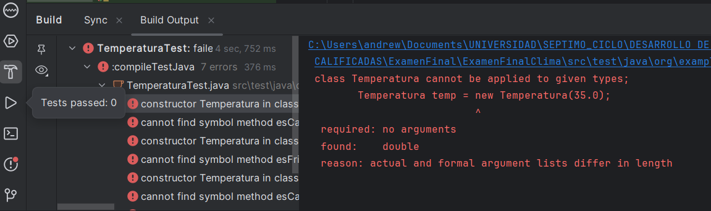

# Sprint 1

Empezemos construyendo nuestras clases primero creando las pruebas unitarias de cada una 

# Implementacion de clases

## Clase Temperatura

### Prueba:

Primero creamos la siguiente prueba

```java
import org.junit.jupiter.api.Test;
import static org.junit.jupiter.api.Assertions.*;

public class TemperaturaTest {
    @Test
    public void testEsCaliente() {
        Temperatura temp = new Temperatura(35.0);
        assertTrue(temp.esCaliente());
    }

    @Test
    public void testEsFrio() {
        Temperatura temp = new Temperatura(5.0);
        assertTrue(temp.esFrio());
    }

    @Test
    public void testNoEsCalienteNiFrio() {
        Temperatura temp = new Temperatura(20.0);
        assertFalse(temp.esCaliente());
        assertFalse(temp.esFrio());
    }
}

```

- `Temperatura temp = new Temperatura(35.0);`: Crea una instancia de la clase `Temperatura` con un valor de 35.0.
- `assertTrue(temp.esCaliente());`: Verifica que el método `esCaliente()` de la instancia `temp` devuelve `true`. Se espera que una temperatura de 35.0 sea considerada "caliente".
- Se crea una instancia de `Temperatura` con un valor de 5.0 y se verifica que `esFrio()` devuelva `true`.
- En el método `testNoEsCalienteNiFrio` se prueba el caso en el que una temperatura (20.0) no es ni "caliente" ni "fría".
- `assertFalse(temp.esCaliente());`: Verifica que `esCaliente()` devuelva `false`.
- `assertFalse(temp.esFrio());`: Verifica que `esFrio()` devuelva `false`.

Ejecutamos las pruebas:



Como podemos ver las pruebas no pasaron debido a que no existe los metodos a los que llama.

Implementaremos la clase Temperatura para hacer pasar las pruebas:

```java
public class Temperatura {
    private double valor;

    public Temperatura(double valor) {
        this.valor = valor;
    }

    public double getValor() {
        return valor;
    }

    public boolean esCaliente() {
        return valor > 30.0; 
    }

    public boolean esFrio() {
        return valor < 10.0; 
    }
}
```

- `esCaliente()` es un método público que devuelve `true` si el valor de la temperatura es mayor que 30.0, indicando que la temperatura se considera "caliente"
- `esFrio()` es un método público que devuelve `true` si el valor de la temperatura es menor que 10.0, lo cual indica que la temperatura se considera "fría". Si no es así, devuelve `false`.

Ahora ejecutamos nuestras pruebas otra ves para ver si pasaron:


## Clase Lluvia

### Prueba:

Ahora creamos la siguiente prueba para la clase Lluvia:

```java
import org.junit.jupiter.api.Test;
import static org.junit.jupiter.api.Assertions.*;

public class LluviaTest {
    @Test
    public void testEsIntensa() {
        Lluvia lluvia = new Lluvia(60.0);
        assertTrue(lluvia.esIntensa());
    }

    @Test
    public void testNoEsIntensa() {
        Lluvia lluvia = new Lluvia(20.0);
        assertFalse(lluvia.esIntensa());
    }
}

```

`testEsIntensa()`: Verifica que una intensidad de lluvia de 60.0 sea considerada "intensa".

- `Lluvia lluvia = new Lluvia(60.0);`: Crea una instancia de la clase `Lluvia` con un valor de intensidad de lluvia de 60.0.
- `assertTrue(lluvia.esIntensa());`: Verifica que el método `esIntensa()` de la instancia `lluvia` devuelva `true`. Esto indica que se espera que una intensidad de lluvia de 60.0 sea considerada "intensa".

`testNoEsIntensa()`: Verifica que una intensidad de lluvia de 20.0 no sea considerada "intensa".

- `Lluvia lluvia = new Lluvia(20.0);`: Crea una instancia de la clase `Lluvia` con un valor de intensidad de lluvia de 20.0.
- `assertFalse(lluvia.esIntensa());`: Verifica que el método `esIntensa()` de la instancia `lluvia` devuelva `false`. Esto indica que se espera que una intensidad de lluvia de 20.0 no sea considerada "intensa".

Ejecutamos la prueba


Como podemos observar las pruebas no pasan debido a que no existen lo metodos a los que llama

Implementaremos la clase Lluvia para hacer pasar las pruebas:

```java
public class Lluvia {
    private double cantidad;

    public Lluvia(double cantidad) {
        this.cantidad = cantidad;
    }

    public double getCantidad() {
        return cantidad;
    }

    public boolean esIntensa() {
        return cantidad > 50.0; 
    }
}

```

- `esIntensa()` es un método público que devuelve `true` si la cantidad de lluvia (`cantidad`) es mayor que 50.0, lo cual indica que la lluvia se considera "intensa". Si no es así, devuelve `false`.

Ahora ejecutamos las pruebas otra ves para ver si pasaron:


## Clase Viento

### Prueba:

Crearemos las siguientes pruebas

```java
import org.junit.jupiter.api.Test;
import static org.junit.jupiter.api.Assertions.*;

public class VientoTest {
    @Test
    public void testEsFuerte() {
        Viento viento = new Viento(80.0);
        assertTrue(viento.esFuerte());
    }

    @Test
    public void testNoEsFuerte() {
        Viento viento = new Viento(30.0);
        assertFalse(viento.esFuerte());
    }
}

```

`testEsFuerte()`: Verifica que una fuerza de viento de 80.0 sea considerada "fuerte".

- `Viento viento = new Viento(80.0);`: Crea una instancia de la clase `Viento` con un valor de fuerza de viento de 80.0.
- `assertTrue(viento.esFuerte());`: Verifica que el método `esFuerte()` de la instancia `viento` devuelva `true`. Esto indica que se espera que una fuerza de viento de 80.0 sea considerada "fuerte".

`testNoEsFuerte()`: Verifica que una fuerza de viento de 30.0 no sea considerada "fuerte".

- `Viento viento = new Viento(30.0);`: Crea una instancia de la clase `Viento` con un valor de fuerza de viento de 30.0.
- `assertFalse(viento.esFuerte());`: Verifica que el método `esFuerte()` de la instancia `viento` devuelva `false`. Esto indica que se espera que una fuerza de viento de 30.0 no sea considerada "fuerte".

Ejecutamos la prueba


Como podemos ver las pruebas no pasaron debido a que no hay las clases que necesita

Implementaremos la clase Viento para hacer pasar las pruebas:

```java
public class Viento {
    private double velocidad;

    public Viento(double velocidad) {
        this.velocidad = velocidad;
    }

    public double getVelocidad() {
        return velocidad;
    }

    public boolean esFuerte() {
        return velocidad > 70.0;
    }
}

```

- `esFuerte()`: Devuelve `true` si la velocidad del viento es mayor que 70.0, indicando que el viento se considera "fuerte".

Ahora ejecutamos las pruebas otra ves para ver si pasaron:


## Clase Humedad

### Prueba:

Primero creamos la siguiente prueba

```java
import org.junit.jupiter.api.Test;
import static org.junit.jupiter.api.Assertions.*;

public class HumedadTest {
    @Test
    public void testEsAlta() {
        Humedad humedad = new Humedad(85.0);
        assertTrue(humedad.esAlta());
    }

    @Test
    public void testNoEsAlta() {
        Humedad humedad = new Humedad(60.0);
        assertFalse(humedad.esAlta());
    }
}

```

`testEsAlta()`: Verifica que un nivel de humedad de 85.0 sea considerado "alto".

- `Humedad humedad = new Humedad(85.0);`: Crea una instancia de la clase `Humedad` con un valor de humedad de 85.0.
- `assertTrue(humedad.esAlta());`: Verifica que el método `esAlta()` de la instancia `humedad` devuelva `true`. Esto indica que se espera que una humedad de 85.0 sea considerada "alta".

`testNoEsAlta()`: Verifica que un nivel de humedad de 60.0 no sea considerado "alto".

- `Humedad humedad = new Humedad(60.0);`: Crea una instancia de la clase `Humedad` con un valor de humedad de 60.0.
- `assertFalse(humedad.esAlta());`: Verifica que el método `esAlta()` de la instancia `humedad` devuelva `false`. Esto indica que se espera que una humedad de 60.0 no sea considerada "alta".

Ejecutamos la prueba


Como podemos ver las pruebas no pasaron debido a que no existen las clases a las que llama.

Implementaremos la clase Humedad para hacer pasar las pruebas:

```java
public class Humedad {
    private double porcentaje;

    public Humedad(double porcentaje) {
        this.porcentaje = porcentaje;
    }

    public double getPorcentaje() {
        return porcentaje;
    }

    public boolean esAlta() {
        return porcentaje > 80.0;
    }
}

```

- `esAlta()` es un método público que devuelve `true` si el porcentaje de humedad (`porcentaje`) es mayor que 80.0, lo cual indica que la humedad se considera "alta". Si no es así, devuelve `false`.

Ahora ejecutamos las pruebas para ver si logramos hacerlas pasar


## Clase PresionAtmosferica

### Prueba:

Primero creamos la siguiente prueba

```java
import org.junit.jupiter.api.Test;
import static org.junit.jupiter.api.Assertions.*;

public class PresionAtmosfericaTest {
    @Test
    public void testEsBaja() {
        PresionAtmosferica presion = new PresionAtmosferica(950.0);
        assertTrue(presion.esBaja());
    }

    @Test
    public void testNoEsBaja() {
        PresionAtmosferica presion = new PresionAtmosferica(1020.0);
        assertFalse(presion.esBaja());
    }
}

```

`testEsBaja()`: Verifica que una presión atmosférica de 950.0 sea considerada "baja".

- `PresionAtmosferica presion = new PresionAtmosferica(950.0);`: Crea una instancia de la clase `PresionAtmosferica` con un valor de presión atmosférica de 950.0.
- `assertTrue(presion.esBaja());`: Verifica que el método `esBaja()` de la instancia `presion` devuelva `true`. Esto indica que se espera que una presión atmosférica de 950.0 sea considerada "baja".

`testNoEsBaja()`: Verifica que una presión atmosférica de 1020.0 no sea considerada "baja"

- `PresionAtmosferica presion = new PresionAtmosferica(1020.0);`: Crea una instancia de la clase `PresionAtmosferica` con un valor de presión atmosférica de 1020.0.
- `assertFalse(presion.esBaja());`: Verifica que el método `esBaja()` de la instancia `presion` devuelva `false`. Esto indica que se espera que una presión atmosférica de 1020.0 no sea considerada "baja".

Ejecutamos la prueba


Como podemos observar las pruebas no pasaron debido a que no existen metodos a los que son llamados.

Implementaremos la clase PresionAtmosferica para hacer pasar las pruebas:

```java
public class PresionAtmosferica {
    private double presion;

    public PresionAtmosferica(double presion) {
        this.presion = presion;
    }

    public double getPresion() {
        return presion;
    }

    public boolean esBaja() {
        return presion < 1000.0; // Ejemplo de criterio
    }
}
```

- `esBaja()` es un método público que devuelve `true` si la presión atmosférica (`presion`) es menor que 1000.0, lo cual indica que la presión se considera "baja". Si no es así, devuelve `false`.

Ahora ejecutamos las pruebas para ver si logramos hacerlas pasar


## Clase AlertaClimatica:

Ahora vamos a implementar la clase donde se ejecutara la aplicacion.

### Prueba:

Primero creamos la siguiente prueba

```java
import org.junit.jupiter.api.Test;
import static org.junit.jupiter.api.Assertions.*;

import java.util.List;

public class AlertaClimaticaTest {
    @Test
    public void testGenerarAlertas() {
        Temperatura temp = new Temperatura(35.0);
        Lluvia lluvia = new Lluvia(25.0);
        Viento viento = new Viento(55.0);

        AlertaClimatica alertaClimatica = new AlertaClimatica(temp, lluvia, viento);
        List<String> alertas = alertaClimatica.generarAlertas();

        assertTrue(alertas.contains("Alerta: Temperatura Alta!"));
        assertTrue(alertas.contains("Alerta: Lluvia Intensa!"));
        assertTrue(alertas.contains("Alerta: Viento Fuerte!"));
    }
}
```

- Se crean instancias de `Temperatura`, `Lluvia` y `Viento` con valores específicos (`35.0`, `25.0` y `55.0` respectivamente).
- Se instancia un objeto `AlertaClimatica` pasando las instancias de `Temperatura`, `Lluvia` y `Viento`.
- Se llama al método `generarAlertas()` de `AlertaClimatica` para obtener la lista de alertas generadas.
- Se utiliza `assertTrue()` para verificar que la lista de alertas (`alertas`) contiene los mensajes esperados como resultado de las condiciones especificadas para temperatura alta, lluvia intensa y viento fuerte.

Ejecutamos la prueba


Como podemos observar las pruebas no pasaron debido a que no existen los metodos a los que son llamados

Implementaremos la clase AlertaClimatica para hacer pasar las pruebas:

```java
public class AlertaClimatica {
    private Temperatura temperatura;
    private Lluvia lluvia;
    private Viento viento;

    public AlertaClimatica(Temperatura temperatura, Lluvia lluvia, Viento viento) {
        this.temperatura = temperatura;
        this.lluvia = lluvia;
        this.viento = viento;
    }

    public List<String> generarAlertas() {
        List<String> alertas = new ArrayList<>();

        if (temperatura.esCaliente()) {
            alertas.add("Alerta: Temperatura Alta!");
        }

        if (lluvia.esIntensa()) {
            alertas.add("Alerta: Lluvia Intensa!");
        }

        if (viento.esFuerte()) {
            alertas.add("Alerta: Viento Fuerte!");
        }

        return alertas;
    }

    public static void main(String[] args) {
        Temperatura temp = new Temperatura(35.0);
        Lluvia lluvia = new Lluvia(25.0);
        Viento viento = new Viento(55.0);

        AlertaClimatica alertaClimatica = new AlertaClimatica(temp, lluvia, viento);
        List<String> alertas = alertaClimatica.generarAlertas();

        for (String alerta : alertas) {
            System.out.println(alerta);
        }
    }
}
```

- `generarAlertas()` es un método público que devuelve una lista de cadenas (`List<String>`) que contiene alertas basadas en las condiciones climáticas.
- Utiliza los métodos `esCaliente()` de `Temperatura`, `esIntensa()` de `Lluvia` y `esFuerte()` de `Viento` para determinar si se deben agregar alertas por alta temperatura, lluvia intensa o viento fuerte.
- El método `main()` crea instancias de `Temperatura`, `Lluvia` y `Viento` con valores específicos.
- Luego crea una instancia de `AlertaClimatica` con estas instancias y genera las alertas correspondientes utilizando `generarAlertas()`.
- Imprime las alertas generadas en la consola.

Ahora ejecutamos las pruebas para ver si logramos hacerlas pasar


Ahora Ejecutemos la clase AlertaClimatica para ver la salida:


Como podemos ver nos da las alertas. 

# Validacion de pruebas con stubs y fakes

Usaremos Mockito para crear los stubs que simulan las condiciones climáticas. Los stubs se usarán en las pruebas unitarias para proporcionar respuestas predefinidas.

Primero ponemos las dependencias de Mockito en el build.gradle:

```java
plugins {
    id 'java'
}

group = 'org.example'
version = '1.0-SNAPSHOT'

repositories {
    mavenCentral()
}

dependencies {
    testImplementation platform('org.junit:junit-bom:5.10.0')
    testImplementation 'org.junit.jupiter:junit-jupiter'
    testImplementation 'org.mockito:mockito-core:4.3.1'
    testImplementation 'org.mockito:mockito-junit-jupiter:4.3.1'
}

test {
    useJUnitPlatform()
}
```

## Pruebas Unitarias con Stubs

### AlertaClimatica

```java
public class AlertaClimaticaTest2 {
    @Test
    public void testGenerarAlertasConStubs() {
        // Creamos stubs usando Mockito
        Temperatura temperaturaStub = Mockito.mock(Temperatura.class);
        Lluvia lluviaStub = Mockito.mock(Lluvia.class);
        Viento vientoStub = Mockito.mock(Viento.class);

        // Configuramos respuestas predefinidas
        when(temperaturaStub.esCaliente()).thenReturn(true);
        when(lluviaStub.esIntensa()).thenReturn(false);
        when(vientoStub.esFuerte()).thenReturn(true);

        AlertaClimatica alertaClimatica = new AlertaClimatica(temperaturaStub, lluviaStub, vientoStub);
        List<String> alertas = alertaClimatica.generarAlertas();

        assertTrue(alertas.contains("Alerta: Temperatura Alta!"));
        assertTrue(alertas.contains("Alerta: Viento Fuerte!"));
        assertTrue(!alertas.contains("Alerta: Lluvia Intensa!"));
    }
}
```

- Creamos stubs utilizando Mockito para las clases `Temperatura`, `Lluvia` y `Viento`.
- Configuramos respuestas predefinidas para los métodos `esCaliente()`, `esIntensa()` y `esFuerte()` de los stubs. Esto define el comportamiento esperado durante la prueba.
- Instanciamos un objeto `AlertaClimatica` utilizando los stubs configurados.
- Se llama al método `generarAlertas()` de `AlertaClimatica` para obtener la lista de alertas generadas.
- Se utilizan métodos de aserción (`assertTrue()` y `assertFalse()`) para verificar que la lista de alertas generadas (`alertas`) contiene los mensajes esperados.

Ejecutamos la prueba:


Podemos observar que las pruebas pasaron con los stubs que creamos

## Implementamos Fakes para pruebas mas complejas

Vamos a crear una clase `CondicionesClimaticasFake` que generará condiciones climáticas en función de los valores predefinidos.

### CondicionesClimaticasFake

```java
public class CondicionesClimaticasFake {
    public static Temperatura getTemperatura(double valor) {
        return new Temperatura(valor);
    }

    public static Lluvia getLluvia(double cantidad) {
        return new Lluvia(cantidad);
    }

    public static Viento getViento(double velocidad) {
        return new Viento(velocidad);
    }
}
```

### Pruebas Unitarias con Fakes

### AlertaClimatica

```java
public class AlertaClimaticaTest3 {
    @Test
    public void testGenerarAlertasConFakes() {
        // Usamos fakes para simular condiciones climáticas
        Temperatura tempFake = CondicionesClimaticasFake.getTemperatura(35.0);
        Lluvia lluviaFake = CondicionesClimaticasFake.getLluvia(60.0);
        Viento vientoFake = CondicionesClimaticasFake.getViento(80.0);

        AlertaClimatica alertaClimatica = new AlertaClimatica(tempFake, lluviaFake, vientoFake);
        List<String> alertas = alertaClimatica.generarAlertas();

        assertTrue(alertas.contains("Alerta: Temperatura Alta!"));
        assertTrue(alertas.contains("Alerta: Lluvia Intensa!"));
        assertTrue(alertas.contains("Alerta: Viento Fuerte!"));
    }
}
```

- Utilizamos los métodos estáticos de `CondicionesClimaticasFake` para obtener instancias de `Temperatura`, `Lluvia` y `Viento` con valores específicos (`35.0`, `60.0` y `80.0` respectivamente).
- Creamos una instancia de `AlertaClimatica` con las instancias de fakes configuradas.
- Llamamos al método `generarAlertas()` de `AlertaClimatica` para obtener la lista de alertas generadas.
- Utilizamos métodos de aserción (`assertTrue()`) para verificar que la lista de alertas generadas (`alertas`) contiene los mensajes esperados ("Alerta: Temperatura Alta!", "Alerta: Lluvia Intensa!", "Alerta: Viento Fuerte!").

Ejecutamos la Prueba:


Se puede apreciar que hicimos pasar la prueba usando Fakes.

# Metricas de Calidad

Usaremos la herramienta Jacoco para medir la cobertura de pruebas

Primero configuraremos el build.gradle para las dependencias de Jacoco

```java
plugins {
    id 'java'
    id 'jacoco'
}

group = 'org.example'
version = '1.0-SNAPSHOT'

repositories {
    mavenCentral()
}

dependencies {
    testImplementation platform('org.junit:junit-bom:5.10.0')
    testImplementation 'org.junit.jupiter:junit-jupiter'
    testImplementation 'org.mockito:mockito-core:4.3.1'
    testImplementation 'org.mockito:mockito-junit-jupiter:4.3.1'
    testImplementation 'org.jetbrains:annotations:24.0.0'
}

test {
    useJUnitPlatform()
}

// jacoco
jacoco {
    toolVersion = "0.8.12" // Versión de JaCoCo (compatible con java 21)
}

jacocoTestReport {
    dependsOn test // Ejecuta las pruebas antes de generar el informe

    reports {
        xml.required.set(true)
        html.required.set(true)
    }
}

check.dependsOn jacocoTestCoverageVerification
```

Ahora usaremos el siguiente comando: 

```java
./gradlew jacocoTestReport
```


Analisemos los siguientes resultados:

- 79 de 220 instrucciones en total no fueron ejecutadas (64% de cobertura).
- 6 de 22 ramas condicionales no fueron ejecutadas (72% de cobertura).
- Se reportan 13 complejidades ciclomáticas perdidas.
- 20 líneas de código no fueron ejecutadas.
- 9 métodos no fueron ejecutados.
- 1 clase no fue ejecutada.

# Refactorizamos

Vamos a hacer la siguiente refactorizacion para la clase `AlertaClimatica` debido a su baja cobertura.

Analisemos que nos dice Jacoco


- El constructor `AlertaClimatica` y el método `generarAlertas()` tienen una buena cobertura de código (100% en términos de instrucciones).
- El método `main(String[])` muestra una cobertura deficiente, con la mayoría de instrucciones y líneas no cubiertas.
- El método `main` tiene 8 ramas en total, de las cuales 4 no fueron cubiertas durante las pruebas.
- Las pruebas existentes pueden no haber abarcado todos los caminos posibles dentro del método `main`, especialmente en relación con las condiciones de alertas climáticas basadas en temperatura, lluvia y viento.